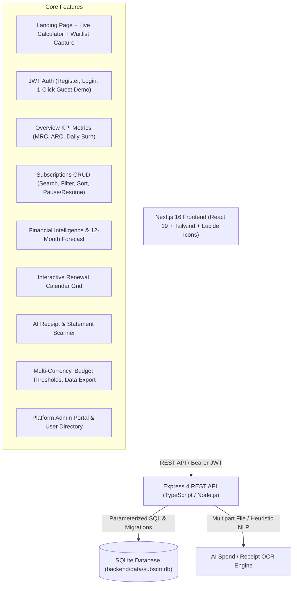

# Subscrr — Full-Stack Subscription Intelligence Platform

> **All your subscriptions. And what they really cost.**
> A complete, full-stack subscription management and financial intelligence web application built with **Next.js 16 (React 19)**, **Node.js / Express (TypeScript)**, and a **persistent SQLite database**.

---

## 🌟 Architecture & Technology Stack



### Why This Stack?
* **Next.js 16 + React 19**: Ultra-fast Turbopack compilation, component encapsulation, modern UX micro-interactions, responsive design across mobile and desktop.
* **Express + TypeScript Backend**: Strict type safety, clean modular separation (routes, middleware, controllers, validation), RESTful conventions.
* **Persistent SQLite**: Zero external installation required for evaluators (no MongoDB daemon or cloud Atlas connection needed). Provides ACID transactional financial integrity, foreign keys, fast analytical queries (`SUM`, `GROUP BY`, date grouping), and disk persistence in `./backend/data/subscrr.db`.
* **JWT & Bcrypt Authentication**: Secure stateless token authentication with password hashing and role-based access control (`user` vs `admin`).

---

## 🚀 Quick Start Guide

### Option 1: Run Both Backend & Frontend with One Command (Root)
From the root repository directory:
```bash
# Run both servers concurrently (Backend on :5000, Frontend on :3000)
npm run dev
```

### Option 2: Run Separately
**Backend:**
```bash
cd backend
npm install
npm run dev
# Backend runs at http://localhost:5000
```

**Frontend:**
```bash
cd frontend
npm install
npm run dev
# Frontend runs at http://localhost:3000
```

---

## 🔑 Pre-Configured Demo Accounts

| Account Type | Email | Password | Role | Description |
| :--- | :--- | :--- | :--- | :--- |
| **Demo User** | `demo@subscrr.app` | `demo123` | `user` | Pre-loaded with 9 sample subscriptions (Netflix, ChatGPT Plus, Spotify, Figma, GitHub Copilot, Midjourney, etc.) |
| **Admin User** | `admin@subscrr.app` | `admin123` | `admin` | Full access to the Admin Portal, platform statistics, and user directory |
| **1-Click Guest Mode** | *(No credentials)* | *(None)* | `user` | Instant access from `/login` with 1 click |

---

## 💎 Features Implemented

### 1. 📊 Executive Overview Dashboard (`/dashboard`)
* **Real-Time Financial Metrics**:
  * **Monthly Recurring Spend (MRC)**: Normalized monthly total across all active subscriptions.
  * **Annual Commitment (ARC)**: 12-month run-rate calculation.
  * **Daily Burn Rate**: Exact amount leaving your account each day.
  * **Active Services Counter**: Categorized into active, trial, and paused.
  * **Next Due Charge Countdown**: Highlights charges due today, tomorrow, or in *X* days.
* **Monthly Budget Progress Gauge**: Visual progress bar alerting you when spending exceeds 80% of your target budget.
* **Upcoming Renewals Timeline**: Nearest upcoming charges with direct 1-click status.
* **Spend by Category Donut & Progress**: Interactive category breakdown with color badges and percentages.
* **Top 5 Highest Cost Expenses**: Quick breakdown of your most expensive subscriptions.

### 2. 🗂️ Subscriptions Manager (`/dashboard/subscriptions`)
* **Full CRUD Functionality**: Create, Read, Update, Pause/Resume, and Delete subscriptions.
* **Multi-Parameter Search & Filtering**:
  * Real-time search across service names, notes, categories, and descriptions.
  * Category pills (`AI Tools`, `Entertainment`, `Music`, `Development`, `Design`, `Cloud Storage`, `Productivity`, `Health`, `Gaming`, `Utilities`).
  * Status tabs (`All`, `Active`, `Free Trial`, `Paused`, `Cancelled`).
* **Multi-Attribute Sorting**: Sort by Next Renewal Date, Amount (High-to-Low / Low-to-High), Name (A-Z), and Date Added.
* **Dual View Modes**: Switch between **Card Grid** and **Compact Table List**.
* **Quick Pause / Resume**: Freeze a subscription to pause its impact on monthly spend without deleting history.
* **CSV & JSON Export**: Download full subscription records with 1 click.
* **1-Click Demo Data Loader**: Instantly repopulates sample subscriptions anytime.

### 3. 🧠 Deep Financial Analytics & Forecasting (`/dashboard/analytics`)
* **12-Month Spend Projection Forecast**: Predictive bar chart plotting estimated renewal charges for the next 12 months.
* **Category Breakdown Matrix**: Detailed table showing monthly spend, percentage share, item count, and annualized impact per category.
* **Smart Cost Optimization Suggestions**:
  * AI Tool consolidation recommendations.
  * Annual vs monthly billing savings estimates (~15-20% savings).
  * Free trial conversion warning indicators.
* **Payment Method Distribution**: Spending breakdown by Apple Pay, Credit Card, PayPal, Google Pay, and Bank Transfer.

### 4. 📅 Interactive Renewal Calendar (`/dashboard/calendar`)
* **Full Monthly Calendar Grid**: Maps every subscription renewal to its exact date of the month.
* **Month Navigation**: Easily jump backward and forward across months or click "Today".
* **Day Detail Inspector**: Click any day on the calendar to see all scheduled charges, individual payment methods, and total sum due on that day.
* **Monthly Commitment Total**: Instant sum of all renewal charges expected in the selected month.

### 5. ✨ AI Spend Receipt & Statement Scanner (`/dashboard/ai-scanner`)
* **Multi-Input Ingestion**:
  1. **1-Click Demo Receipt Library**: Test instant extraction with real-world sample invoices (OpenAI ChatGPT Plus, Netflix Premium, GitHub Copilot Annual, Figma Seat).
  2. **Image Dropzone**: Upload receipt screenshots / invoices (PNG, JPG, WebP, PDF).
  3. **Statement Text Parser**: Paste bank or credit card statement transaction text.
* **Intelligent Extraction Engine**:
  * Auto-detects merchant/service name.
  * Extracts price and currency (`$`, `€`, `£`, `₹`, `¥`, `CAD`, `AUD`).
  * Detects billing frequency (Daily, Weekly, Monthly, Quarterly, Yearly).
  * Assigns accurate category, brand color, and icon.
  * Calculates next renewal date.
  * Generates a confidence score (e.g. 96%).
* **1-Click Add to Subscriptions**: Directly saves the extracted subscription to the SQLite database and updates all analytics immediately.

### 6. 🔔 Smart Alerts & Notifications (`/dashboard`)
* **In-App Notification Center**: Notification bell dropdown with unread counter badges.
* **Automated Renewal Nudges**: Generates alerts 1 day and 3 days before renewal dates.
* **Trial Expiration Warnings**: Alerts when free trials are about to convert into paid subscriptions.
* **Budget Threshold Alerts**: Warns when recurring expenses approach or exceed your monthly budget limit.
* **Mark-as-Read & Mark-All-Read**: Interactive notification management.

### 7. ⚙️ Settings, Multi-Currency & Data Portability (`/dashboard/settings`)
* **Profile Management**: Update display name and email.
* **Multi-Currency Converter**: Choose between USD (`$`), EUR (`€`), GBP (`£`), INR (`₹`), JPY (`¥`), CAD (`$`), and AUD (`$`).
* **Monthly Budget Target**: Configure spending limits with live visual feedback.
* **Backup & Restore**: Export full JSON/CSV backups or restore demo subscriptions.

### 8. 🛡️ Platform Admin Portal (`/dashboard/admin`)
* Accessible to users with the `admin` role (`admin@subscrr.app`).
* **Platform Metrics**: Total registered accounts, total tracked subscriptions, active subscription count, total platform Monthly Recurring Volume (MRC), and waitlist lead counts.
* **User Directory**: View all platform users, their roles, default currency, and subscription counts.

### 9. 🌐 Landing Page Enhancements (`/`)
* **Dynamic Header & Hero**: Live authentication-aware buttons ("Launch Web App", "Dashboard", "Sign In", "Get the App").
* **Interactive Live Subscription Calculator**: Real-time sliders allowing landing page visitors to calculate their annual subscription leak and estimated savings before logging in.
* **Early Access / Waitlist Lead Capture**: Form connected to `/api/leads` backend endpoint storing submissions in SQLite.

---

## 📡 API Reference

### Authentication (`/api/auth`)
* `POST /api/auth/register` — Create new account (email, password, name, currency, budget)
* `POST /api/auth/login` — Sign in and receive JWT token
* `POST /api/auth/demo` — Instant 1-click guest demo session
* `GET /api/auth/me` — Get current user profile and quick stats (Protected)
* `PUT /api/auth/profile` — Update user profile, default currency, and budget limit (Protected)

### Subscriptions (`/api/subscriptions`)
* `GET /api/subscriptions` — Fetch subscriptions (Supports `search`, `category`, `status`, `billing_cycle`, `sortBy`, `sortOrder`)
* `GET /api/subscriptions/:id` — Fetch single subscription by ID
* `POST /api/subscriptions` — Create a new subscription
* `PUT /api/subscriptions/:id` — Update subscription details
* `PATCH /api/subscriptions/:id/toggle-status` — Toggle between active and paused
* `DELETE /api/subscriptions/:id` — Delete subscription
* `POST /api/subscriptions/seed-demo` — Restore demo dataset for current user
* `GET /api/subscriptions/export/csv` — Export subscriptions as CSV file
* `GET /api/subscriptions/export/json` — Export subscriptions as JSON file

### Financial Analytics (`/api/analytics`)
* `GET /api/analytics/summary` — Full financial summary (MRC, ARC, daily burn, category breakdowns, upcoming renewals, top spends)
* `GET /api/analytics/projections` — 12-month future spend projection by month

### Calendar Schedule (`/api/calendar`)
* `GET /api/calendar?month=X&year=Y` — Scheduled renewals mapped by calendar day

### AI Spend Scanner (`/api/ai`)
* `GET /api/ai/samples` — List built-in sample receipts for testing
* `POST /api/ai/scan-receipt` — Parse receipt image or statement text with AI parser

### Notifications (`/api/notifications`)
* `GET /api/notifications` — Get user notifications and unread count
* `PATCH /api/notifications/:id/read` — Mark notification as read
* `POST /api/notifications/read-all` — Mark all notifications as read

### Leads & Waitlist (`/api/leads`)
* `POST /api/leads` — Capture early access / newsletter lead from landing page
* `GET /api/leads` — List all captured leads (Admin only)

### Admin (`/api/admin`)
* `GET /api/admin/stats` — Platform KPI metrics and category distribution (Admin only)
* `GET /api/admin/users` — User directory and subscription counts (Admin only)

---

## 🧪 Automated Testing

Run the automated integration test suite:
```bash
cd backend
npm test
```
**Test Coverage Includes:**
- Server health check (`GET /api/health`)
- Demo login & JWT verification (`POST /api/auth/demo`)
- User profile & subscription stats (`GET /api/auth/me`)
- Subscriptions listing & filtering (`GET /api/subscriptions`)
- Subscription creation (`POST /api/subscriptions`)
- Status toggle active $\leftrightarrow$ paused (`PATCH /api/subscriptions/:id/toggle-status`)
- Subscription deletion (`DELETE /api/subscriptions/:id`)
- Analytics calculation engine (`GET /api/analytics/summary`)
- Calendar monthly projection (`GET /api/calendar`)
- AI Receipt parsing (`POST /api/ai/scan-receipt`)
- Landing page waitlist capture (`POST /api/leads`)
