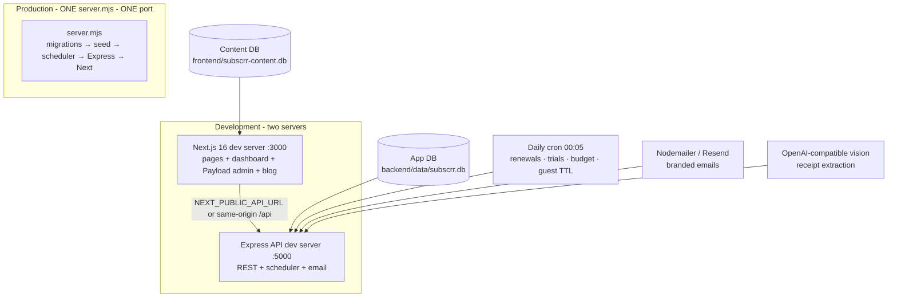

# Subscrr — Subscription Intelligence Platform

> **All your subscriptions. And what they really cost.**
> Track every recurring charge, see the true daily/monthly/yearly cost, get warned *before* money leaves your account — with a blog engine (Payload CMS), AI receipt scanning, real email delivery, and a one-command single-service production deployment.

A complete full-stack product: **Next.js 16 (React 19) + Tailwind 4** frontend, **Express 4 (TypeScript)** API, **SQLite** databases, **Payload CMS 3** blog engine, JWT auth, branded email, AI vision receipt extraction, automated alert cron, CI, versioned migrations, and a unified single-port production server (`server.mjs`) that deploys to Render as **one service**.

---

## Table of Contents

1. [What Subscrr Does](#what-subscrr-does)
2. [Feature Tour — Every Page](#feature-tour--every-page)
3. [Architecture](#architecture)
4. [The Two Data Stores](#the-two-data-stores)
5. [Project Structure](#project-structure)
6. [Prerequisites](#prerequisites)
7. [Quick Start (Development)](#quick-start-development)
8. [Environment Variables — Complete Reference](#environment-variables--complete-reference)
9. [Accounts & Logins](#accounts--logins)
10. [Email Delivery (Password Resets & Alerts)](#email-delivery-password-resets--alerts)
11. [AI Receipt Scanner — Enabling Real AI](#ai-receipt-scanner--enabling-real-ai)
12. [Database & Migrations](#database--migrations)
13. [Payload CMS — The Blog Engine](#payload-cms--the-blog-engine)
14. [API Reference](#api-reference)
15. [Testing](#testing)
16. [Production: Single-Service Deployment](#production-single-service-deployment)
17. [Deploy to Render (One Service, One URL)](#deploy-to-render-one-service-one-url)
18. [Local Production Rehearsal](#local-production-rehearsal)
19. [Security Model](#security-model)
20. [Responsive Design](#responsive-design)
21. [CI/CD](#cicd)
22. [Scripts Reference](#scripts-reference)
23. [Troubleshooting](#troubleshooting)
24. [Roadmap Notes](#roadmap-notes)

---

## What Subscrr Does

Most people cannot answer: *"How many subscriptions do you have, and what do they total?"* Netflix, Spotify, ChatGPT Plus, iCloud, Notion… each feels small; together they are the new cable bill — plus forgotten subs, surprise annual renewals, trial conversions, and mixed currencies.

Subscrr solves this in four moves:

1. **Track** — add subscriptions manually or scan a receipt with the AI Spend Scanner (real AI vision when configured, honest local parsing otherwise).
2. **See the truth** — every billing cycle (daily/weekly/monthly/quarterly/yearly) normalizes into one honest picture: Monthly Spend, Annual Commitment, Daily Burn Rate.
3. **Never be surprised** — a daily background job fires renewal alerts (1 day / 3 days before), trial-end warnings, and budget-threshold alerts as in-app notifications **and real emails**.
4. **Analyze** — category breakdowns, 12-month projections, cost-optimization suggestions, payment-method distribution — all multi-currency aware.

The core value: banks show you money **after** it leaves. Subscrr shows you **before**.

---

## Feature Tour — Every Page

### Public site

| Page | What's on it |
|---|---|
| `/` | Landing page: hero, **interactive leak calculator** (drag sliders, see annual waste + savings), feature sections, phone mockups, waitlist lead capture |
| `/blog` | Blog index rendered from **Payload CMS** (ISR — fresh content appears within 60s of publishing, no rebuild) |
| `/blog/[slug]` | Full article pages: hero image, rich text, tags, related posts, JSON-LD for SEO |
| `/login`, `/register` | Auth forms with inline validation, lockout messaging |
| `/forgot-password`, `/reset-password` | Full reset flow: request → email with single-use 1-hour token → set new password |

### Dashboard (auth required)

| Page | What's on it |
|---|---|
| `/dashboard` | **Overview**: Monthly Spend, Annual Commitment, Daily Burn, Active Services, Next Charge countdown, budget progress gauge (warns ≥80%), upcoming renewals timeline, category donut, top-5 most expensive |
| `/dashboard/subscriptions` | Full **CRUD** table/grid: search across names/notes, category pills, status tabs (Active / Trial / Paused / Cancelled), multi-attribute sorting, card & compact-table views, pause/resume, **CSV + JSON export**, demo data loader |
| `/dashboard/analytics` | 12-month spend projection chart, category matrix (monthly, %, count, annualized), **cost-optimization suggestions** (annual-billing savings ~15–20%, AI-tool consolidation, trial warnings), payment-method distribution |
| `/dashboard/calendar` | Monthly renewal grid: every charge on its day, month navigation, "Today" jump, click a day → full charge inspector with per-day total |
| `/dashboard/ai-scanner` | **AI Spend Scanner**: drag-drop image upload with scan animation → parsed result card (merchant, actual printed amount, currency, cycle, category, brand color, confidence meter, engine badge); or paste statement text for local parsing; 1-click add |
| `/dashboard/settings` | Profile, display currency (USD/EUR/GBP/INR/JPY/CAD/AUD), monthly budget target, **email preference toggles** (per alert type), JSON/CSV backup export |
| `/dashboard/admin` | **Admin Portal** (role-gated): platform KPIs (users, subscriptions, active count, platform MRC, waitlist leads), user directory |
| Notification bell | Dropdown with unread badge; click a notification → animated check-mark + slide-out removal (**permanent delete**, not just read); X for bulk-dismiss |

### Multi-currency

Subscriptions are stored with their **original currency and integer-cent amounts**. Analytics convert to your display currency using live rates from the open.er-api.com exchange API (with resilient built-in fallback rates if the API is unreachable). A $9.99 USD + ₹299 INR mix still produces one honest total.

---

## Architecture



- **Backend**: Express 4 + TypeScript, Zod validation on every write, helmet security headers, strict CORS allowlist, layered rate limiters, JWT (HS256) auth, bcrypt password hashing, integer-cent money math, node-cron alert scheduler, Nodemailer/Resend transport with dev fallbacks.
- **Frontend**: Next.js 16 App Router, React 19, Tailwind CSS 4, Lucide icons, Recharts analytics, GSAP/Lenis motion on the landing page, Payload CMS 3 embedded at `/admin` with SQLite adapter and generated migrations.
- **Unified production server** (`server.mjs`): mounts the compiled Express app first; its error handler only fires on errors, so every non-API request falls through to the compiled Next.js app (which also serves Payload's admin/REST/GraphQL). One process, one port, one deploy.

## The Two Data Stores

Deliberately separated — app data and content data never mix:

| | **App DB** | **Content DB** |
|---|---|---|
| File | `backend/data/subscrr.db` | `frontend/subscrr-content.db` |
| Owns | users, subscriptions, notifications, activity_logs, leads, password_reset_tokens | Payload: posts, media, blog-authors, versions |
| Schema | hand-written versioned migrations (`backend/src/db/migrations.ts`) | Payload-generated migrations (`frontend/src/migrations/`), auto-applied in production |
| GUI | [DB Browser for SQLite](https://sqlitebrowser.org/) / VS Code "SQLite Viewer" extension | same |
| Git | gitignored — regenerated by migrations + seed on first boot | gitignored — regenerated by `payload:seed` + auto-migrations |

Browse either with **DB Browser for SQLite** (the "MongoDB Compass of SQLite"): open the file → *Browse Data* tab. Browse **read-only** while a server is running.

## Project Structure

```
SUBSCRR/
├── server.mjs                  # unified single-port production server
├── render.yaml                 # Render Blueprint (one service + persistent disk)
├── package.json                # root scripts: dev, build, start:all, build:render…
├── .github/workflows/ci.yml    # CI: typecheck + tests + builds + Docker builds
├── backend/                    # Express API (TypeScript)
│   ├── src/
│   │   ├── app.ts              # Express app: helmet profiles, CORS, limiters, routes
│   │   ├── server.ts           # dev/prod boot: migrations → seed → scheduler → listen
│   │   ├── config.ts           # env config with fail-safe production checks
│   │   ├── routes/             # auth, subscriptions, analytics, calendar, ai,
│   │   │                       # notifications, activity, leads, admin, currency
│   │   ├── middleware/         # auth (JWT), validation (Zod), rate limiters, errors
│   │   ├── services/           # email (Resend/SMTP/dev), alerts, scheduler, currency
│   │   ├── db/                 # connection, migrations (000/001/002), seed
│   │   └── test/               # vitest integration suite (isolated test DB)
│   ├── data/                   # subscrr.db (gitignored, auto-created)
│   └── uploads/                # private receipt uploads (gitignored, token-gated)
├── frontend/                   # Next.js 16 + Payload CMS
│   ├── app/
│   │   ├── (frontend)/         # public site + dashboard pages
│   │   └── (payload)/          # Payload admin + REST + GraphQL wiring (owned by Payload)
│   ├── collections/            # Posts, Media, BlogAuthors (Payload collection configs)
│   ├── src/migrations/         # Payload-generated DB migrations
│   ├── content/posts.ts        # original seed content (6 posts)
│   ├── lib/                    # api client, blog adapter, money formatting
│   ├── payload.config.ts       # CMS config (collections, routes, migrations)
│   └── subscrr-content.db      # content DB (gitignored, auto-created)
├── docs/
│   ├── DEPLOY-RENDER.md        # full Render deployment walkthrough
│   ├── subscrr-user-guide.html # print source for the PDF guide
│   ├── Subscrr-User-Guide.pdf  # 12-page illustrated product guide
│   └── guide-assets/           # 18 real product screenshots (JPG)
└── .freebuff/                  # dev tooling (phone audit script, capture scripts)
```

## Prerequisites

- **Node.js ≥ 20** (Node 22/24 works; check with `node --version`)
- **npm** (comes with Node)
- That's all — SQLite needs **no** installation, daemon, or cloud account.
- Optional: [DB Browser for SQLite](https://sqlitebrowser.org/) to inspect data, Docker for container builds.

## Quick Start (Development)

From the repository root:

```bash
# 1. Install everything (root + backend + frontend)
npm run install:all

# 2. Start BOTH dev servers with one command
npm run dev
#    BACKEND  → http://localhost:5000  (auto-migrates + seeds on boot)
#    FRONTEND → http://localhost:3000  (opens the landing page)

# 3. First time only: seed the blog CMS (6 posts + images)
cd frontend && npm run payload:seed && cd ..
```

Then open **http://localhost:3000**. Sign in as `admin@subscrr.app` / `admin123` (dev bootstrap — see [Accounts](#accounts--logins)), or register a fresh account.

Run servers separately if you prefer:

```bash
npm run dev:backend     # Express on :5000
npm run dev:frontend    # Next on :3000
```

Both apps read `.env` files automatically (`backend/.env`, `frontend/.env`). Copy `backend/.env.example` to `backend/.env` for a documented starting point — the app boots fine in dev with zero configuration.

## Environment Variables — Complete Reference

### Backend (`backend/.env` — see `backend/.env.example` for the annotated version)

| Variable | Default (dev) | Required in prod? | Purpose |
|---|---|---|---|
| `PORT` | `5000` | auto (Render sets it) | API port |
| `NODE_ENV` | `development` | **yes** (`production`) | switches security posture |
| `JWT_SECRET` | dev fallback + warning | **yes** (≥32 chars; server **refuses to boot** without it) | token signing |
| `DB_PATH` | `./data/subscrr.db` | recommended (`/opt/data/subscrr.db`) | app DB location |
| `UPLOAD_DIR` | `./uploads` | recommended | receipt uploads |
| `FRONTEND_URL` | `http://localhost:3000` | **yes** (public URL) | reset-email links, CMS URLs, CORS default |
| `CORS_ORIGINS` | — | if serving from other origins | comma-separated browser allowlist |
| `ADMIN_PASSWORD` | `admin123` (dev) | **yes** (≥8 chars; refuses boot without it) | bootstrap admin password |
| `RESEND_API_KEY` | — | one of these | email via Resend HTTP API (recommended) |
| `SMTP_HOST` `SMTP_PORT` `SMTP_SECURE` `SMTP_USER` `SMTP_PASS` | — | one of these | email via any SMTP (Gmail app password works) |
| `EMAIL_FROM` | — | with email | e.g. `Subscrr <alerts@yourdomain.com>` |
| `OPENAI_API_KEY` | — | for AI vision | enables receipt image scanning |
| `OPENAI_BASE_URL` `OPENAI_MODEL` | OpenAI defaults | optional | any OpenAI-compatible provider (OpenRouter, vLLM…) |

Email resolution order: **Resend → SMTP → Ethereal (dev-only, shows preview links) → JSON logger (offline)**. Without a provider, production boots but prints a loud warning and `/api/health` reports the transport as unconfigured.

### Frontend (`frontend/.env`)

| Variable | Default (dev) | Required in prod? | Purpose |
|---|---|---|---|
| `PAYLOAD_SECRET` | dev fallback | **yes** (build/boot fails without it) | CMS session encryption |
| `PAYLOAD_DATABASE_URI` | `file:./subscrr-content.db` | **yes** (`file:/opt/data/subscrr-content.db`) | content DB (needs `file:` scheme) |
| `PAYLOAD_MEDIA_DIR` | `./media-uploads` | recommended | CMS image storage |
| `PAYLOAD_ADMIN_EMAIL` | `admin@subscrr.local` | recommended | CMS admin created by seed |
| `PAYLOAD_ADMIN_PASSWORD` | `ChangeMe-Payload-2026!` | **yes** | CMS admin password |
| `NEXT_PUBLIC_API_URL` | prod: same-origin `/api` · dev: `localhost:5000/api` | only for split deployments | API base for the browser |

### Both apps, production add-ons

| Variable | Purpose |
|---|---|
| `DATA_DIR` | convenience root for Render's persistent disk (see render.yaml) |
| `EMAIL_TRANSPORT` debug | inspect via `GET /api/health` → `email` field (`resend` / `smtp` / `ethereal` / `json`) |

## Accounts & Logins

| Account | Email | Password | Notes |
|---|---|---|---|
| **App admin (bootstrap)** | `admin@subscrr.app` | `admin123` in dev · `$ADMIN_PASSWORD` in prod | created automatically on first boot, idempotent; role `admin` → sees Admin Portal |
| **CMS admin (Payload)** | `admin@subscrr.local` | `ChangeMe-Payload-2026!` · `$PAYLOAD_ADMIN_PASSWORD` in prod | created by `payload:seed`; separate identity system from the app **by design** |
| **Your account** | whatever you register | — | first registered user is a normal user; promote to admin via SQL if ever needed |
| **Guest demo session** | via API only | — | `POST /api/auth/demo` provisions an **isolated per-session guest** (`@demo.subscrr.local`) with sample data + 24h TTL. The old shared demo account was removed for security; the UI entry point was removed from the login page |

Change the dev passwords before any real deployment (`ADMIN_PASSWORD`, `PAYLOAD_ADMIN_PASSWORD`).

## Email Delivery (Password Resets & Alerts)

Already wired end-to-end — you only add credentials:

1. **Resend (recommended for production):** create an API key at resend.com → `RESEND_API_KEY=re_...` + `EMAIL_FROM=Subscrr <alerts@yourdomain.com>`.
2. **Gmail SMTP (fine for testing/small volume):** enable 2-Step Verification → create an App Password at myaccount.google.com/apppasswords → set `SMTP_HOST=smtp.gmail.com`, `SMTP_PORT=587`, `SMTP_USER=you@gmail.com`, `SMTP_PASS=<16-char app password>`.
3. **Dev fallback (zero config):** Ethereal — emails aren't delivered; reset flows surface the preview link on-screen with a clear "dev mode" banner, and `/api/health` reports `email: "ethereal"`.

What emails go out: **welcome** (on register), **password reset** (hashed single-use token, 1-hour expiry), **renewal alerts** (1-day/3-day), **trial-end warnings**, **budget alerts** — each toggleable per user in Settings → email preferences.

## AI Receipt Scanner — Enabling Real AI

- **With a key:** add `OPENAI_API_KEY=sk-...` to `backend/.env`, restart. Images are sent to the vision model, which returns strictly-validated JSON: merchant, the **actually-printed amount**, currency, billing cycle, category, next renewal, brand color, and its own confidence score. Any OpenAI-compatible provider works (`OPENAI_BASE_URL`, `OPENAI_MODEL`).
- **Without a key:** pasted statement **text** still works through a clearly-labeled "Basic local parse" (regex-based, honest); image uploads return a clean 503 telling you to configure the key.
- **No invention policy:** non-subscription documents produce a 422 error; undeterminable amounts come back as 0 with an honest note — the scanner never fabricates prices.

## Database & Migrations

**App DB** — versioned, append-only migrations in `backend/src/db/migrations.ts`:

| ID | What it does |
|---|---|
| `000_full_schema_baseline` | full current schema for fresh databases |
| `001_integer_cents_money` | integer-cent money storage (no float drift) |
| `002_email_preferences` | per-user email alert toggles |

Run automatically at server boot; also `npm run migrate` (root or backend). Never edit a shipped migration — add a new one.

**Content DB** — Payload-generated migrations in `frontend/src/migrations/` (regenerate after collection changes: `npx payload migrate:create`). In production they **auto-apply on first connect**, so a fresh cloud DB provisions itself. In dev, drizzle's schema push applies changes directly.

**Seed data** — both seeds are idempotent (safe on every boot/deploy): the app seed ensures the bootstrap admin; the CMS seed (`npm run payload:seed` in frontend) creates the CMS admin + 6 blog posts with hero images.

## Payload CMS — The Blog Engine

The blog is database-backed and admin-editable — no code changes needed to publish:

- **Where:** `http://localhost:3000/admin` (dev or prod — same app). Login with the CMS admin credentials above.
- **Collections:** **Posts** (title, excerpt, slug, category, tags, date, read-minutes, accent color, featured flag, hero image, Lexical rich-text body, draft/published status, version history), **Media** (image uploads with auto-generated card/hero/thumb sizes via sharp), **Blog Authors** (CMS users).
- **Publishing flow:** Log in → Posts → edit or **Create New** → fill fields → upload hero image → **Publish**. The blog index revalidates within 60s; new articles appear automatically (`revalidate = 60`, dynamicParams on).
- **Namespacing:** Payload's REST/GraphQL live under `/api/payload` and `/graphql` so they never collide with the Express API at `/api/*`.
- **Config on disk:** `frontend/payload.config.ts` + `frontend/collections/*.ts`. After changing collection fields: regenerate types, create a migration, rebuild.

## API Reference

Base URL: `http://localhost:5000/api` (dev) · same-origin `/api` (single-service prod). All responses: `{ success, message?, data?, error? }`. Protected routes need `Authorization: Bearer <token>`.

### Auth — `/api/auth`
| Method | Path | Auth | Notes |
|---|---|---|---|
| POST | `/register` | — | email, password (≥8), name; returns JWT |
| POST | `/login` | — | rate-limited; per-account lockout after 5 failures (423 + retry time) |
| POST | `/demo` | — | isolated guest account, 24h TTL |
| GET | `/me` | ✅ | profile + quick stats (generous session rate limit) |
| PUT | `/profile` | ✅ | name, currency, budget |
| POST | `/forgot-password` | — | sends reset email (tight per-email rate limit) |
| GET | `/verify-reset-token/:token` | — | validates single-use token |
| POST | `/reset-password` | — | consumes token, sets new password |

### Subscriptions — `/api/subscriptions` (all ✅, user-scoped)
| Method | Path | Notes |
|---|---|---|
| GET | `/` | filters: `search`, `category`, `status`, `billing_cycle`; sort: `sortBy`, `sortOrder` |
| GET | `/:id` | single subscription |
| POST | `/` | create (Zod-validated; amounts stored as integer cents) |
| PUT | `/:id` | update |
| PATCH | `/:id/toggle-status` | active ⇄ paused |
| DELETE | `/:id` | delete |
| POST | `/seed-demo` | restore sample dataset for current user |
| POST | `/advance-renewals` | demo/time-travel helper, user-scoped |
| GET | `/export/csv` | sanitized CSV download |
| GET | `/export/json` | JSON backup |

### Analytics — `/api/analytics` (✅)
- `GET /summary` — MRC, ARC, daily burn, category breakdown, upcoming renewals, top spends, payment-method mix (multi-currency converted)
- `GET /projections` — 12-month forward projection

### Calendar — `/api/calendar` (✅)
- `GET /?month=M&year=Y` — renewals mapped to calendar days

### AI — `/api/ai`
- `POST /scan-receipt` — multipart image (AI vision when configured) or `{ text }` (local parse); honest errors, never invented data

### Notifications — `/api/notifications` (✅)
| Method | Path | Notes |
|---|---|---|
| GET | `/` | list + unread count |
| PATCH | `/:id/read` | mark read |
| POST | `/read-all` | mark all read |
| DELETE | `/:id` | **permanent removal** (powers the animated dismissal) |
| GET / PATCH | `/email-preferences` | per-user alert-type toggles |
| POST | `/check-reminders` | manual trigger of the alert job |

### Other routes
- `GET /api/currency/rates?base=USD` · `POST /api/currency/convert` — live FX with fallback rates
- `GET /api/activity` — user's recent activity log
- `POST /api/leads` · `GET /api/leads` (admin) — waitlist capture
- `GET /api/admin/stats` · `GET /api/admin/users` — platform KPIs (admin role)
- `GET /api/health` — process + **real DB check** (`db.ok`, latency, email transport); 503 when DB is down
- `/api/payload/*` + `/graphql` — Payload CMS REST/GraphQL (separate auth)

## Testing

```bash
cd backend
npm test          # vitest run — 35 integration tests, isolated test DB
npm run test:watch
```

Covers: health check, register/login/me, subscription CRUD + filters + toggle + delete, analytics math, calendar mapping, receipt parsing, leads capture — all against a dedicated test database (never your dev data). CI runs the same suite on every push/PR (plus typecheck, builds, and Docker builds for both apps).

## Production: Single-Service Deployment

One Node process (`server.mjs`) serves **everything** on one port:

```
node server.mjs
 ├─ runs app-DB migrations + idempotent seed
 ├─ starts the daily alert scheduler (single instance only)
 ├─ mounts Express:  /api/*  /uploads/*      (strict CSP, auth, limiters)
 └─ hands everything else to Next.js: pages, /_next, /admin,
                                     /api/payload/*, /graphql   (Payload CMS)
```

Start it with `npm run start:all` after `npm run build`. Payload REST/GraphQL requests pass through Express untouched (no app rate-limit budget drain, no body-parser double-read); security headers switch profiles per route family (strict CSP on API surfaces, Next-managed CSP on pages/admin).

## Deploy to Render (One Service, One URL)

Full walkthrough in **[docs/DEPLOY-RENDER.md](docs/DEPLOY-RENDER.md)**. Short version:

1. Push this repo to GitHub.
2. Render Dashboard → **New → Blueprint** → select the repo (Render reads `render.yaml`).
3. Fill the prompted secrets: `JWT_SECRET`, `PAYLOAD_SECRET`, `ADMIN_PASSWORD`, `PAYLOAD_ADMIN_PASSWORD` (generation commands are in the doc).
4. First build: backend dist → CMS seed (posts + images) → Next build → boot → **migrations + admin auto-provision on the persistent disk** (`/opt/data`: both DBs, uploads, media — survives redeploys).
5. Health check at `/api/health`; set `FRONTEND_URL` to your Render URL and redeploy once.

Caveats to know: **cold starts** on free/starter (~30–60s after 15 min idle — paid Starter avoids it), and keep **maxInstances = 1** (set in render.yaml; SQLite + the scheduler are single-writer — for horizontal scale move to Postgres + S3 first). Also: **back up the disk** — Render disks don't snapshot automatically.

## Local Production Rehearsal

Prove the production build before deploying (fresh data dir simulates Render's empty disk):

```bash
npm run build    # backend dist + frontend .next

NODE_ENV=production PORT=4000 \
DB_PATH=./data-render/subscrr.db UPLOAD_DIR=./data-render/uploads \
PAYLOAD_DATABASE_URI=file:./data-render/subscrr-content.db \
PAYLOAD_MEDIA_DIR=./data-render/media-uploads \
JWT_SECRET=local-rehearsal-secret-0123456789abcdef \
PAYLOAD_SECRET=local-rehearsal-payload-0123456789ab \
ADMIN_PASSWORD=local-admin-pass-123 \
PAYLOAD_ADMIN_PASSWORD=local-cms-pass-123 \
npm run start:all
```

Verify: `/api/health` → `db.ok:true`; landing, `/login`, `/blog`, `/admin` all 200; sign in; create a subscription. (Seed the CMS first with the same env vars: `npm --prefix frontend run payload:seed`. Windows users: point the payload vars at a **rehearsal** DB, never the dev one — see Troubleshooting.)

## Security Model

- **Auth**: bcrypt-hashed passwords, JWT signed HS256 with a ≥32-char secret (server **refuses production boot** without one), 7-day expiry
- **Brute force**: IP rate limiters (login 25/15min; `/auth/me` on a separate generous session budget so page loads never lock you out) **plus per-account lockout** (5 failures → 423 with retry time)
- **Password reset**: SHA-256-hashed single-use tokens, 1-hour expiry, constant-time lookup
- **Headers**: helmet with per-family CSP profiles, HSTS in production, no `x-powered-by`
- **CORS**: explicit origin allowlist — never wildcard in production
- **Uploads**: private receipts served only with a valid Bearer token — no anonymous enumeration
- **Validation**: Zod schemas on every write; parameterized SQL everywhere (no string-built queries)
- **Exports**: CSV injection-sanitized (formula-prefixed cells neutralized)
- **Money**: integer cents end-to-end — no floating-point drift
- **Secrets**: all gitignored (`.env`, DBs, dist, uploads); fail-safe boot checks in production

## Responsive Design

Every public and dashboard page is verified layout-clean from **320 px phones through tablets to desktop** by a rerunnable headless-Chrome audit (`.freebuff/phone-audit.mjs` — measures every element against the viewport on every route). The notifications dropdown is viewport-clamped so it can never overhang even on the smallest phones.

## CI/CD

`.github/workflows/ci.yml` runs on every push/PR to `main`:

| Job | Steps |
|---|---|
| **Backend** | npm ci → typecheck → vitest (isolated DB) → tsc build |
| **Frontend** | npm ci → typecheck → lint → Next build |
| **Docker** | builds both Dockerfiles (deploy-ready images) |

## Scripts Reference

**Root** (`package.json`): `dev` (both servers) · `dev:backend` / `dev:frontend` · `install:all` · `build` (backend dist + Next build) · `start:all` (unified server) · `build:render` (backend → CMS seed → Next build — the Render command) · `migrate` · `seed` · `test:backend` · `typecheck` (both apps) · `docker:build` / `docker:up` / `docker:down`

**Backend**: `dev` · `build` · `start` · `test` / `test:watch` · `typecheck` · `migrate` · `seed`

**Frontend**: `dev` · `build` · `start` · `lint` · `typecheck` · `payload:seed` (idempotent CMS seed) · `payload:start-prod`

## Troubleshooting

| Symptom | Cause & fix |
|---|---|
| `EADDRINUSE :3000/:5000` | a server is already running — kill it (`netstat -ano \| grep :3000`, then `taskkill //F //PID <pid>`) or change `PORT` |
| 429 "Too many requests" while developing | you hit the 25/15min login limiter (auth probes, audits). Restart the backend (in-memory limiter clears) — `/auth/me` page loads are on a separate budget and won't cause this |
| 423 on login | per-account lockout after 5 failed attempts — wait out the shown cool-off or restart the backend (dev only) |
| Yellow "email is mocked" banner on reset screen | no email provider configured — that's the dev fallback; add SMTP/Resend creds to send real mail |
| Reset link on screen instead of inbox (dev) | Ethereal fallback — expected without credentials |
| AI scanner: 503 "configure OPENAI_API_KEY" | image scanning needs the key; text parsing works without it |
| Production build hangs on a Payload **interactive migration prompt** | the build is pointed at a **dev-pushed** content DB. Point `PAYLOAD_DATABASE_URI` at a fresh/rehearsal DB — on Render this is handled automatically |
| `Cannot find module 'next'/'express'` from `server.mjs` | run `npm run install:all` — the root server loads these via bridge files from each app's node_modules |
| Landing page renders but dashboard data empty | backend not running or `NEXT_PUBLIC_API_URL` wrong — check `/api/health` directly |
| Fresh clone: login fails | the bootstrap admin may not exist yet — start the backend once (seeds on boot), check logs for `Created Admin User` |
| DB locked errors | WAL + 5s busy-timeout are configured; ensure you didn't open the DB **writable** in a GUI app while the server runs |

## Roadmap Notes

- **Per-file ACL + signed URLs** for receipt uploads (currently token-gated static serving) and a **private object bucket** as the production-grade end state
- **Postgres + S3** swap for multi-instance scaling (single-instance SQLite + disk is the deliberate v1 trade-off, priced accordingly)
- Payload CMS: watch deprecation warnings; `push`-style dev flow is dev-only, production uses generated migrations (in place)
- Bank auto-sync (Plaid-class aggregation) is the natural next product pillar — the data model is already multi-currency and category-aware
